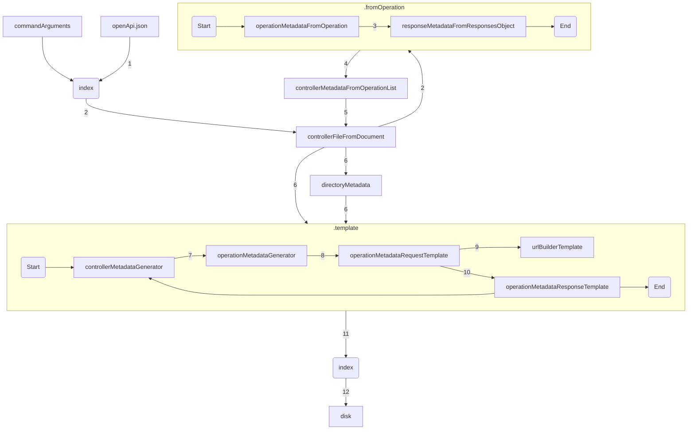
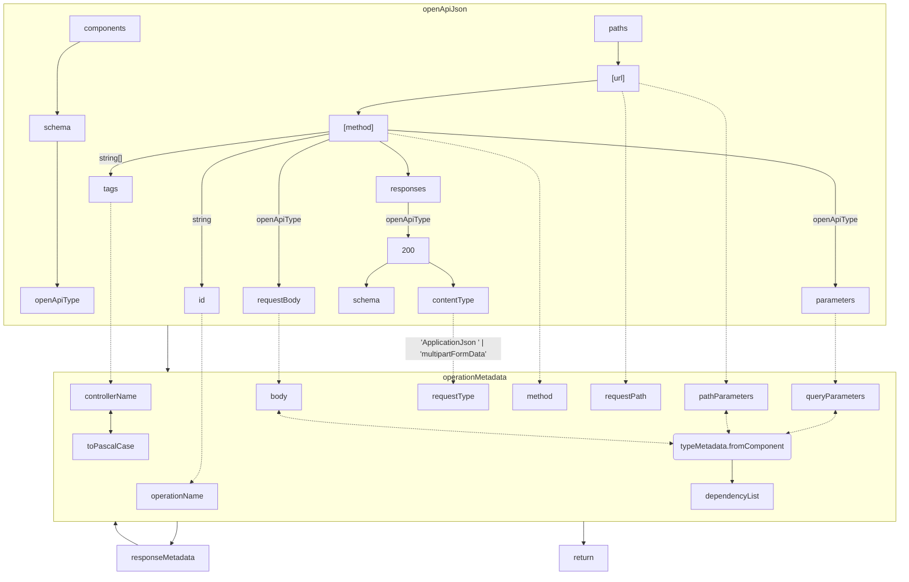
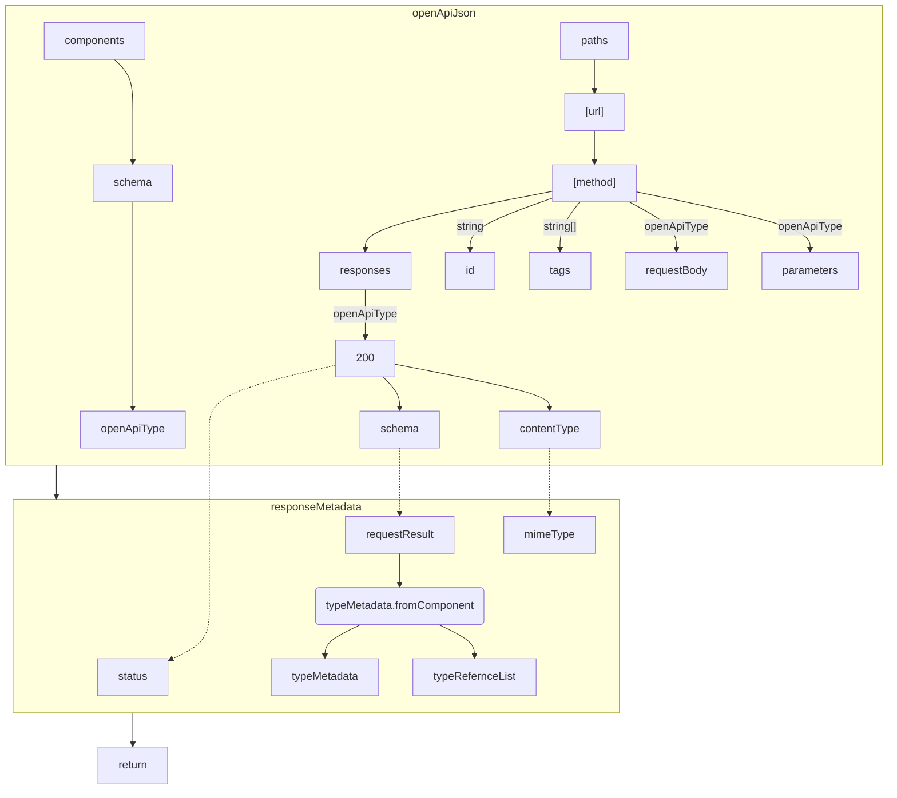

#### Scop
Popularea obiectului DirectoryMetadata si scrierea lui pe disc conform json-ului 
de openApi primit.

#### Overview program flow

- pentru fiecare `path` si `metoda` din OpenApi se creeaza un `OperationMetadata` ce reprezinta 
endpoint-ul ce trebuie apelat si argumentele acceptate 
- un `OperationMetadata` contine si `ResponseMetadata` ce reprezinta raspunsul operatiei
- din lista de `OperationMetadata` sunt grupate in `ControllerMetadata` in functie de taguri 
- functia `controllerMetadataGenerator` adauga in `DirectoryMetadata` fisierele ce o sa fie scrise pe disc din lista de `ControllerMetadata`
- Se scrie pe disc conform `DirectoryMetadata`



#### OperationMetadata



#### Response Metadata


### templateString
Functie utilitara ce este folosita pentru a compune codul rezultat

- ajusteaza identarea textului la minimul gasit la fiecare linie
- valorile sunt sterse daca:
  - undefined value
  - length property = 0
  - false value

### DirectoryMetadata
Emuleaza un sistem de fisiere avand posibilitatea de a creea, citii si 
aflarea path-ul fisierelor folosit pentru a tine in memorie ce fisiere 
trebuiesc scrise pe disc

- createFile
- createOrGetFile


- getAllFilesRecursively
- getRoot

 
- insertFileToDirectory
- findDirectoryInChildren


- getStringPathToRoot
- getStringPathTo

### TypeMetadata

#### resolveReferences
Pe baza unei liste de `TypeMetadata` se rezolva pe baza tipului referintele si se intoarce o lista cu `TypeMetadata` si numele lor

#### fromSchemaObject
Se creeaza `TypeMetadata` pe baza `OpenApiv3.SchemaObject` sau `OpenApiv3.ReferenceObject`

- Edge cases
  - `string`
    - daca formatul este `binary` atunci `TypeMetadata` este `BlobType`
    - daca are field-ul `enum` atunci `TypeMetadata` este `EnumType`
  - `Object`
    - Proprietatea este optionala in urmatorii pasi:
      1. daca obiectul este nullable atunci sunt propietatile sunt optionale altfel sunt required
      2. apoi daca obiectul este nullable si daca cheia proprietatii nu exista in lista required din schemaObject atunci devine optional
 ```mermaid
flowchart LR
schemaObjectNullable{schema.nullable}

schemaObjectNullable

schemaObjectNullable --false-->required

schemaObjectRequired{exista in schema.required}
schemaObjectNullable --> schemaObjectRequired

schemaObjectRequired --true--> required
schemaObjectRequired --false--> optional 
```

### Teste

Majoritatea testelor sunt organizate ca un singur caz pe fisier deoarece se valideaza continutul 
a mai multor fisiere si este mult cod


#### Organizarea unui fisier
Fisierele respective sunt impartite in 3 parti

1. Se pregatesc datele, unde
   - path e endpointul luat identic din openApi
   - components si el este luat identic din openApi
```js
const paths = {
  "/requestPath": {
    "get": {
      "tags": [
        "ControllerName"
      ],
      "operationId": "operationName",
      "parameters": [],
      "responses": {}
    },
  }
}

const components:any = {
  schemas: {}
}

```
2. Se foloseste utilitarul sa ruleze testele
```js
describe(helper.name(__filename), () => {
  helper.test(__filename, paths, components)
});
```

3. Se declara continutul fisierelor ce sunt asteptate sa existe

```js
///Expected: ./_fetcher.ts
/*
const notImplemented:any = () => {
  throw Error("Not implemented")
}

type ClientType = {
  call: typeof fetch
}

export const fetcher: ClientType = {
  call: notImplemented
};
*/
///Expected-End
```
- Logica este urmatoarea
  - se citeste de pe disc fisierul de test
  - se gaseste unde sa declarat fisierul rezultat pe baza
 ```
///Expected [ruta fata de root]
/*
 ```
   - delimitat de ce semnifica sfarsitul fisierului 
```
\*
///Expected-End
```
  - continutul intre cele 2 delimitari reprezinta continutul fisierului respectiv exact cum este 
(nu mai este nevoie sa fie escapate simbolurile)


#### helper
Utilitarul folosit testeaza ca
- rezultatul `controllerFileFromDocument` contine macar o operatie
- pentru fiecare operatie in rezultat exista declarat in fisier
- continutul declarat este identic cu cel rezultat
- fiecare fisier declarat in test exista in rezultat
